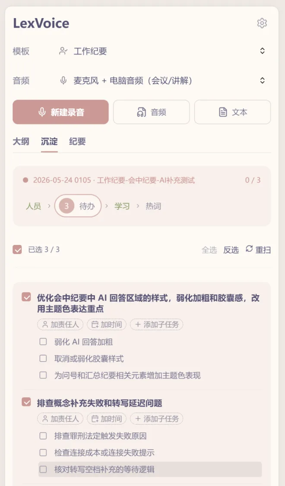
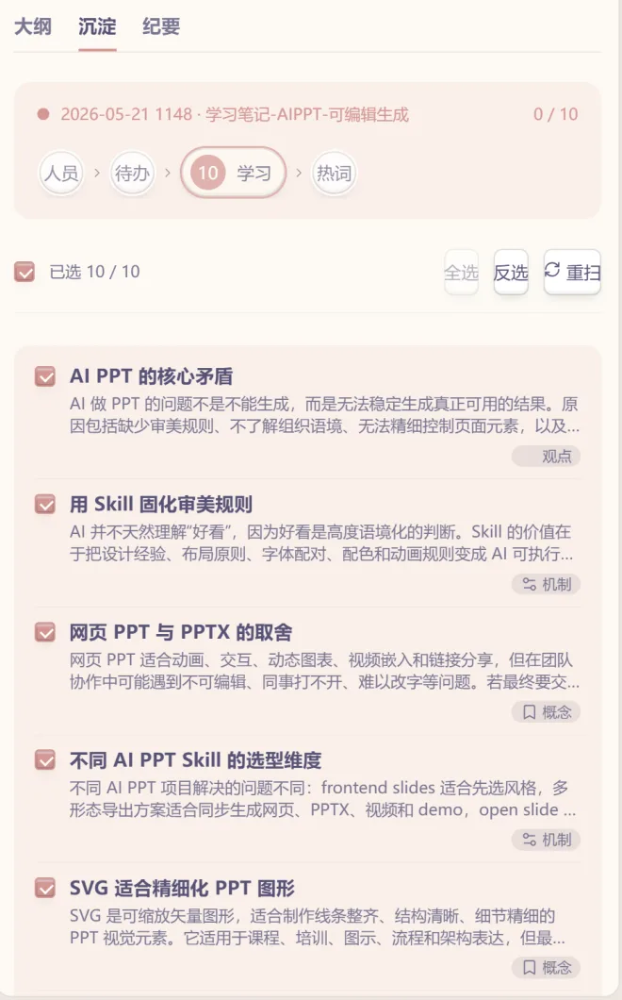
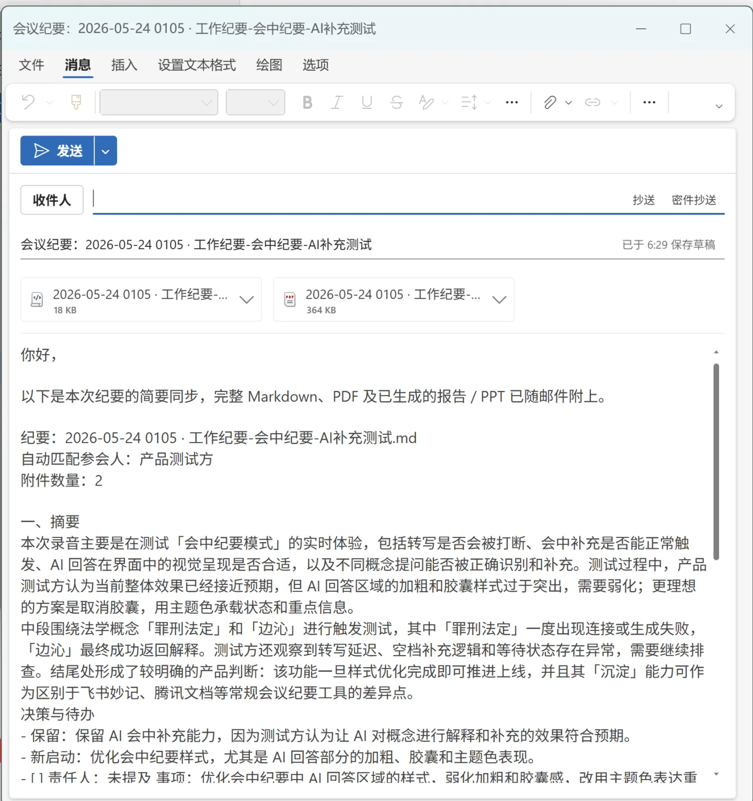
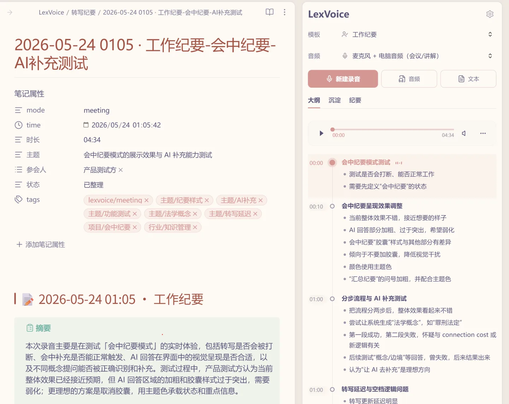

# QnALog

[English](README.md) | 简体中文

**把对话变成结构化知识。**

面向 Obsidian 的开源对话智能：录音、转写，并把会议、访谈、讲座和语音笔记整理成可复用的 Markdown。

QnALog 不连接自有云服务，也不内置任何 API Key：语音转写（ASR）和大语言模型（LLM）服务需要你自行配置。录音与生成的笔记都保存在你自己的知识库中。

支持 Obsidian 桌面端和移动端。移动端录音使用设备麦克风；电脑音频、虚拟声卡、多声道采集、桌面设备检测，以及需要自定义鉴权请求头的实时流式 ASR，需要使用桌面端。

## 来源

QnALog 派生自 Lynnx 的 [LexVoice](https://github.com/Lynn-x/LexVoice)，基于其最后一个 MIT 授权版本（2.1.2）。上游自 2.2.0 起改用专有许可；本项目是 MIT 授权代码的独立延续，不是那条发布线的延续。详见 [`NOTICE`](NOTICE) 与 [`MAINTAINING.md`](MAINTAINING.md)。

## 功能

### 实时大纲

录音时，章节会随着内容逐步生成。录音结束后，大纲章节会与播放器联动；点击章节即可跳转到对应的录音位置。停止录音后，AI 会继续补全并整理最终纪要。

### 会中纪要

录音过程中，可以在大纲下方随时补充现场笔记。输入内容的首字符会触发不同处理方式。

调用 AI 助手：

- `#概念`：结合当前讨论解释该术语的含义。
- `?问题`：根据当前转写和大纲回答问题。
- `!重点`：标记需要重点保留的内容，并在最终纪要中优先处理。

只做标记，不调用 AI：

- `@指派人`：记录事项由谁跟进，最终整理待办时会优先关联对应人员。
- `/待办`：把现场记录明确标记为待办候选。

半角和全角符号都可以识别。会中补充会作为标注清楚的“现场补充材料”进入最终整理，不会混入原始转写正文。

### 问一问

当最终纪要遗漏了某个细节，或者需要重新核对内容时，可以针对当前纪要提问。QnALog 会同时参考整理后的纪要和保留的原始转写。觉得有价值的回答可以写回 Markdown，并统一收纳在一个紧凑的“问一问”章节中。

### 长会议与失败恢复

在普通会议和学习笔记模式中，长录音不会完全依赖一次超长的 LLM 输出。QnALog 会先建立全局议题图，再分部整理内容；每个已完成部分都会保存本地检查点，最后按时间顺序组装成完整纪要。

如果请求中断，或者模型达到输出长度上限，已经完成的部分会被复用，只重试尚未完成的部分。原始转写始终保留；未完整生成的结果会明确显示为“部分完成”，不会被保存成空纪要。

### 处理进度

处理进度面板会区分语音转写、AI 整理和 Markdown 写入，显示当前阶段、最近活动、失败原因以及重试或取消入口。语音转写失败和 AI 整理失败会分别记录，可以从真正失败的步骤继续，而不必重新执行整条链路。

### 沉淀工作流

每篇纪要可以由 AI 拆成四组候选内容，通过流水线方式逐组确认、合并或忽略：

- **人员**：逐条判断留下、合并或忽略。
- **待办**：默认选中，可编辑责任人、截止时间和子任务。
- **学习**：概念、机制、案例、观点和问答。
- **热词**：人名、机构、品牌和专业术语，用于提升后续 ASR 识别效果。

### 对象库

QnALog 可以把会议中值得复用的内容保存为独立的 Obsidian 对象，包括人员档案、待办卡片、学习卡片和 ASR 热词，并生成概念墙、待办墙和学习卡片墙。所有内容都保存在你自己的知识库中；下次会议再次提到同一个人时，可以关联已有档案，而不是重复创建。

<p align="center">
  
  
</p>

### 待办增强

在候选阶段即可行内编辑责任人、截止时间和子任务，不需要打开额外弹窗。入库后的待办使用标准 Markdown 任务语法，可被 Tasks 等插件识别。删除或重新整理时会保留来源信息，便于追溯。

### 录音可靠性

- 录音前后显示音量电平，可确认麦克风和电脑音频是否真正有输入。
- 音频设备始终由用户选择；虚拟或远程设备名称只作为提示，不会被插件自动拒绝或强制选中。
- 设置页提供设备检测，用于排查“录到了文件但没有声音”的问题。
- 对于确认存在独立声道的兼容设备，可以按声道转写并生成说话人标签，随后映射为真实姓名；无法确认独立声道时不会启用分离。
- 删除转写记录时，可以选择是否一并删除对应录音文件。

### 导出

同一篇纪要可以继续生成 HTML 报告、PDF 报告或 `.eml` 邮件草稿。内容保持一致，只根据使用场景调整呈现形式。

<p align="center">
  
</p>

### 纪要列表

侧边栏可以按文件夹或按时间组织最近纪要。文件夹分组支持折叠，当前打开的纪要会高亮；两种视图都可以继续使用搜索和模板筛选。

## 基本使用

1. 打开 QnALog 侧边栏。
2. 选择纪要模板和音频输入。
3. 开始录音，并确认音量电平会随声音变化。
4. 查看实时大纲，需要时添加会中补充。
5. 停止录音，在“处理进度”中查看转写和 AI 整理状态。
6. 如果处理被中断，可以只重试失败步骤；如果纪要遗漏信息，可以使用“问一问”。
7. 打开“沉淀”，确认人员、待办、学习卡片和热词。
8. 需要分享时，可继续生成 HTML 报告、PDF 报告或邮件草稿。

<p align="center">
  
</p>

默认目录如下，均可在设置中修改：

| 内容 | 路径 |
|---|---|
| 录音 | `LexVoice/录音` |
| 转写纪要 | `LexVoice/转写纪要` |
| 会议资料 | `LexVoice/会议资料` |
| 人员档案 | `LexVoice/人员` |
| 学习卡片 | `LexVoice/学习卡片` |
| 待办卡片 | `LexVoice/待办卡片` |
| 视图 | `LexVoice/视图` |
| HTML 报告 | `LexVoice/HTML报告` |
| 邮件草稿 | `LexVoice/邮件草稿` |
| 词汇表 | `LexVoice/词汇表.md` |

> 默认目录仍保留 `LexVoice/` 前缀，是为了兼容从早期版本沿用这些设置的知识库。它们只是普通路径，随时可以在设置中修改。

## 使用要求

必需：

- Obsidian 1.10.0 或更高版本。
- 一个语音转写服务，可以是云端 API 或本地服务。
- 用于保存录音和纪要的知识库目录。

建议：

- 一个 LLM 服务，用于实时大纲、纪要整理、沉淀、导出和模板调整。
- 需要录制电脑或在线会议声音时，准备虚拟音频设备。
- 需要同时录制自己声音时，准备真实麦克风。
- 维护领域词汇表，可以改善人名、产品、机构和专业术语的识别。

## 电脑音频与真实麦克风

Obsidian 桌面端无法在所有平台上稳定、统一地直接采集电脑音频。录制在线会议、网页视频、课程或电脑正在播放的内容时，通常需要使用**虚拟音频设备**：

- Windows：VB-Cable
- macOS：BlackHole
- Linux：PulseAudio / PipeWire monitor source

在 Windows 使用 VB-Cable 时，需要注意设备名称：

- 会议软件、浏览器或系统输出 → **CABLE Input**
- QnALog 读取 → **CABLE Output**，它属于录音设备
- 如果还要录制自己的声音，真实麦克风必须选择物理麦克风，而不是 CABLE Output、BlackHole、VoiceMeeter 或 Stereo Mix

如果音量电平没有变化，请先运行设备检测，再开始长时间录音。

## 隐私、网络与文件访问

没有广告、行为分析或遥测。设置保存在 `.obsidian/plugins/qnalog/data.json`。

**网络用途。** 除非你配置了需要联网的服务，QnALog 完全离线工作。需要联网时，请求只会发往你自行配置的地址：

- 语音转写请求把音频发送给你配置的转写服务。
- AI 整理请求把转写文本和 Prompt 上下文发送给你配置的大模型服务。
- 更新检查会向本项目的 GitHub 发布页请求 `manifest.json`，仅用于提示存在新版本；它不会下载或安装任何文件。

录音保存在你指定的本地知识库目录中；没有 QnALog 云端，也没有 QnALog 服务器。

**知识库之外的文件。** 可选的“外部收件箱”功能可以监视知识库之外的一个文件夹（绝对路径，例如同步盘里的录音目录）并从中导入音频。只有在你主动配置了该路径时才会发生这种访问，且仅限于读取你指定的文件。

涉及客户资料、医疗、法律、人力资源、招聘或内部战略等敏感内容时，建议使用本地转写和本地模型，并在录音前取得相关人员同意。详情见 [`PRIVACY.md`](PRIVACY.md)。

## 安装

本插件不在 Obsidian 社区插件目录中。目录里的 **LexVoice** 条目属于上游项目——见「来源」。

### 方式一：BRAT（桌面端与移动端都可用）

1. 从社区插件目录安装并启用 **BRAT**。
2. 在 BRAT 中选择 **Add beta plugin**，填入 `qnalog/qnalog`。
3. 安装后在「设置 → 第三方插件」中启用 **QnALog**。

### 方式二：从源码构建（桌面端）

```bash
git clone https://github.com/qnalog/qnalog.git
cd qnalog
npm ci
npm run build
npm run install:vault -- "/你的知识库路径"
```

`install:vault` 会把 `main.js`、`manifest.json`、`styles.css`、`LICENSE`、`NOTICE` 复制到 `<知识库>/.obsidian/plugins/qnalog/`，把即将被覆盖的内容（含 `data.json`）整份留档到 `<知识库>/.obsidian/qnalog-install-backups/<时间戳>/`；首次安装时还会从已有的 `lexvoice` 或 `lexvoice-mit` 插件目录沿用设置。

随后在 Obsidian 中重新加载（`Ctrl/Cmd + R`），启用 **QnALog**。

若设置结构发生了变化，插件会在首次加载时给出迁移报告：一条通知，加上诊断日志里的一份完整对照表——哪些分组被丢弃、哪些被保留、需要重新选择什么。

### 回滚

每次安装都会把即将被覆盖的插件目录整份留档，因此回滚是一条命令：

```bash
npm run restore:vault -- "<知识库>/.obsidian/qnalog-install-backups/<时间戳>" "/你的知识库路径"
```

`restore:vault` 从备份的 `manifest.json` 读出插件 id 与版本、还原对应目录，并先把当前目录另存一份——所以回滚本身也可以撤销（命令会打印出来）。它还会告诉你 Obsidian 当前启用的是哪个插件 id；加 `--set-enabled` 可让脚本直接改写 `community-plugins.json`（否则在 Obsidian 界面里切换）。备份位于知识库之外时，请显式传入知识库路径。

说明：设置目录名跟随插件 id，因此从源码安装的版本与 BRAT 安装的版本共用 `.obsidian/plugins/qnalog/`。

## 构建与校验

```bash
npm ci
npm run build   # 版本对齐、符号检查、类型检查、esbuild 打包、移动端加载检查
npm test        # vitest
npm run verify  # lint + build + test
```

## 许可证与致谢

MIT，详见 [`LICENSE`](LICENSE)、[`NOTICE`](NOTICE)，以及 [`MAINTAINING.md`](MAINTAINING.md) 中的维护政策。

原始 LexVoice 代码版权归 Lynnx（2026）；本项目的修改版权归 Q&A Log Team（2026）。
